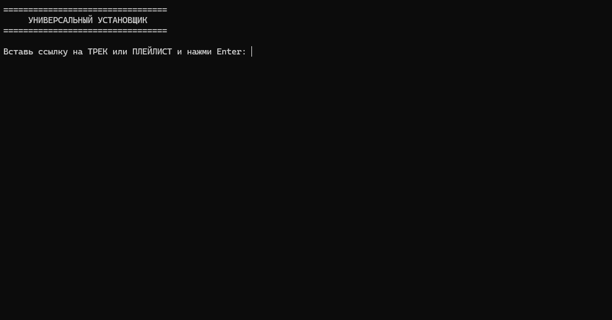
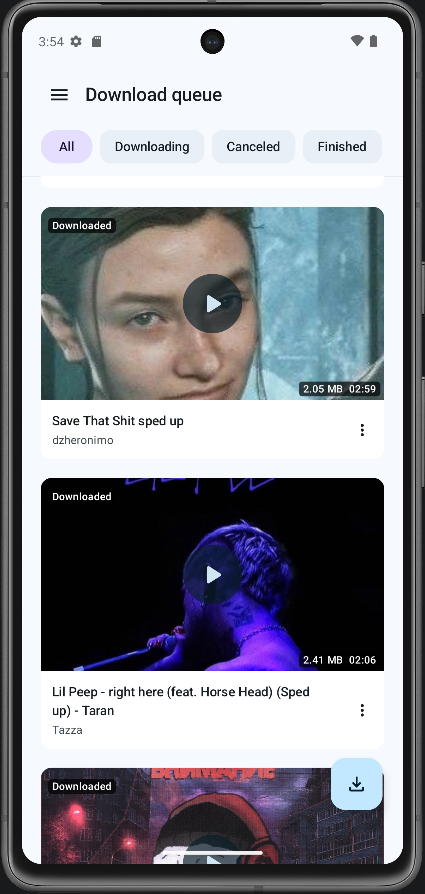
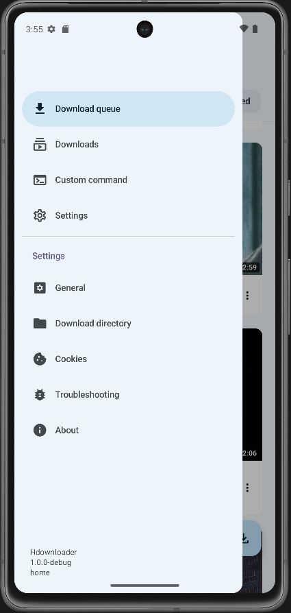

# Универсальный загрузчик SoundCloud 🎵


Простой скрипт (.bat) для Windows, который скачивает музыку и плейлисты из SoundCloud в формате MP3 в максимальном качестве. 

## Особенности
- **Автоматизация:** Скрипт сам скачивает актуальную версию `yt-dlp` при первом запуске.
- **Сортировка:** Автоматически раскладывает треки по папкам (согласно названиям плейлистов).
- **Метаданные:** Вшивает в MP3 оригинальные обложки, имя автора и название трека.
- Скачивает даже скрытые (приватные) плейлисты (если запускать через браузер Chrome).

## Как использовать
1. Скачайте файл `.bat` из этого репозитория (нажмите на файл -> скачайте через кнопку Raw или Download).
2. Положите файл в пустую папку, куда хотите сохранять музыку.
3. Запустите скрипт двойным кликом.
4. Вставьте ссылку на трек или плейлист и нажмите Enter.

## Важное требование (FFmpeg)
Сам загрузчик скачивается автоматически, но **для конвертации звука в MP3** в вашей системе Windows должен быть установлен декодер FFmpeg.
Самый простой способ его установить: 
Откройте PowerShell от имени администратора и введите команду: `winget install Gyan.FFmpeg`, после чего перезагрузите ПК.
## 🐧 Для пользователей Linux

Специально для Linux в репозитории лежит скрипт `downloader.sh`.

### Установка зависимостей
В Linux скрипт не скачивает утилиты сам (ради безопасности), поэтому перед первым запуском нужно установить `yt-dlp` и `ffmpeg`. 
Для Ubuntu/Debian выполните в терминале:
```bash
sudo apt update
sudo apt install yt-dlp ffmpeg
```
## 📱 Версия для Android (на базе Seal)




Теперь у проекта появилась полноценная мобильная версия! Больше не нужно настраивать консоль, вводить команды или ковыряться в Termux. Приложение имеет удобный графический интерфейс и адаптировано специально для скачивания аудио.

В качестве фундамента был взят отличный open-source загрузчик **Seal**, из которого я убрал всё лишнее, чтобы сделать упор на быстродействие и фокус на музыке.

### ✨ Основные возможности:
* **Выбор любой папки:** Полная свобода хранения. Вы можете выбрать абсолютно любую папку во внутренней памяти смартфона или на SD-карте для сохранения треков.
* **Полная автономность:** Приложение уже содержит в себе всё необходимое (библиотеки `yt-dlp` и `FFmpeg`). Ничего настраивать отдельно не придётся.
* **Скачивание в один клик:** Можно отправлять треки на закачку напрямую из официального приложения SoundCloud (или любого другого), просто нажав кнопку **«Поделиться»** и выбрав это приложение в списке.
* **Современный интерфейс:** Дизайн в стиле Material You, который автоматически подстраивается под цвета вашей системы.

### 🚀 Как установить:
1. Перейдите в раздел **Releases** (Релизы) этого репозитория.
2. Скачайте самый свежий файл `.apk`.
3. Установите его на свой Android-смартфон (разрешите установку из неизвестных источников, если система об этом попросит).
4. Откройте приложение, один раз укажите желаемую папку для музыки в настройках и качайте любимые треки без ограничений!
